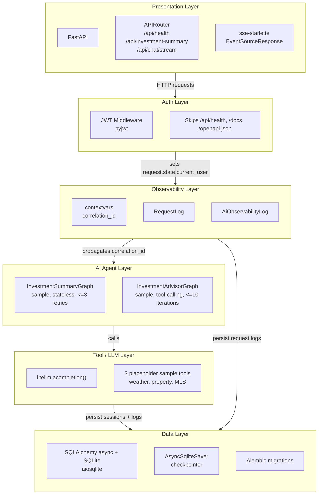
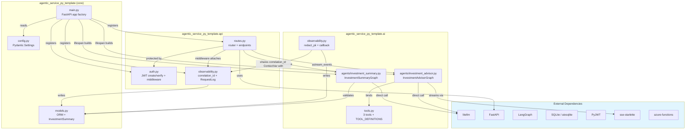
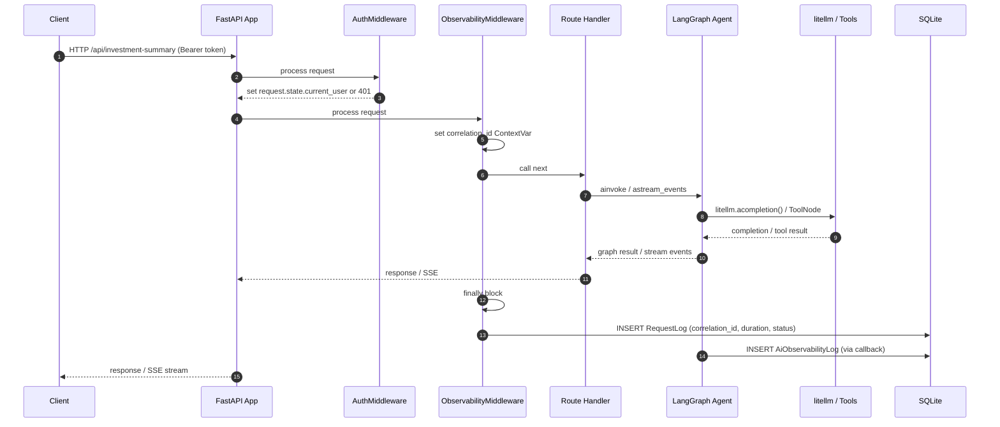
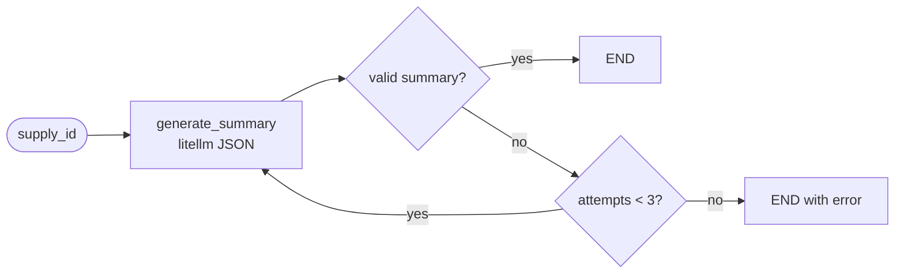
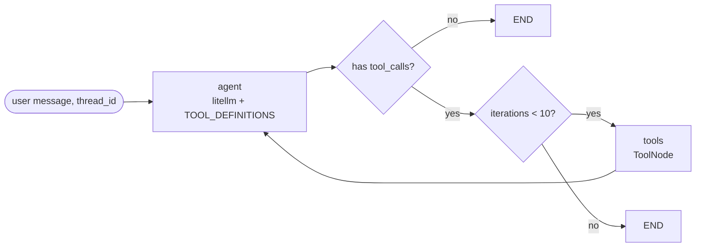
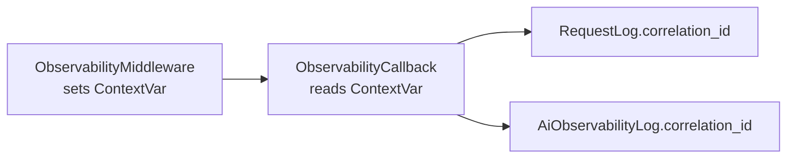

# agentic-service-py-template — Architecture Document

> **This project is a structured reference template for building agentic REST services in Python.**
> It demonstrates one approach to layering, application composition, middleware, observability,
> persistence, and agent orchestration that borrows from patterns well-established in the .NET
> service ecosystem — adapted to the realities of the Python AI/ML stack.

This document is intentionally a living architecture note. It captures the current shape of
the template and the learning process of translating established .NET service architecture
instincts into Python-native agentic service patterns.

**Status:** 88/88 tests passing
**Stack:** FastAPI + Server-Sent Events (SSE), litellm + LangGraph, SQLAlchemy async + SQLite
**Language:** Python 3.14.3
**Package Manager:** `uv`

---

## 1. Overview

The bundled sample service exposes two AI-driven endpoints over REST — one synchronous, one streaming — with a six-layer architecture that keeps concerns cleanly separated:

- A **synchronous** `/api/investment-summary` endpoint that generates a structured JSON investment summary for a given `supply_id`.
- A **streaming** `/api/chat/stream` SSE endpoint that runs a tool-calling investment advisor chatbot.

The design is deliberately minimal: no `AIProvider` ABC, no `CacheService`, no `AgentSessionManager`, no gRPC surface. LangGraph's `thread_id` and `AsyncSqliteSaver` handle session persistence; `litellm.acompletion()` is invoked directly from graph nodes. The project identity is the generic template `agentic-service-py-template`; the investment/property naming inside `src/` is example content that demonstrates how a bundled sample implementation can be structured.

In this template, "plugin based" primarily means composable Python middleware and application
components, similar to the .NET middleware pipeline. The extension model today is explicit
composition through modules, package exports, middleware registration, and application wiring.

### Architectural intent

The template is meant to give agentic services the same kind of predictable shape that mature
ASP.NET Core services often have:

- A composition root that owns app startup, resource lifetimes, middleware, and route registration.
- Thin HTTP endpoints that translate transport concerns and delegate work.
- Agent graphs that act like application services: they coordinate use cases without owning HTTP or database plumbing.
- Tool modules that behave like adapters around external systems, schemas, and LLM-callable functions.
- Shared infrastructure for configuration, persistence, authentication, observability, and tests.

The result is intentionally boring in the best way: new behavior should land in the obvious
module, shared concerns should stay shared, and a future maintainer should be able to trace a
request from HTTP to agent to tool to persistence without spelunking through unrelated files.

As the template evolves, this document should keep recording the reasoning behind those
translations: what maps cleanly from .NET, what needs to be adapted for Python, and
what should stay intentionally simple instead of becoming framework machinery.

---

## 2. Tech Stack

| Component | Technology | Purpose |
|-----------|------------|---------|
| Web framework | FastAPI | HTTP routing, dependency injection, ASGI app |
| Streaming | `sse-starlette` `EventSourceResponse` | SSE stream for chatbot responses |
| LLM routing | `litellm` | Unified completion calls to GitHub Models / Azure OpenAI |
| Agents | LangGraph | State machines for summary retry and tool-calling advisor |
| Session persistence | `langgraph-checkpoint-sqlite` `AsyncSqliteSaver` | Per-`thread_id` checkpoint store |
| Data access | SQLAlchemy async + `aiosqlite` | Async ORM and SQLite driver |
| Migrations | Alembic | Schema migrations for both observability tables |
| Auth | PyJWT | HS256 Bearer token validation |
| Configuration | Pydantic Settings | `ASPT_`-prefixed environment variables |
| Testing | pytest-asyncio, httpx | Async unit + integration tests against FastAPI ASGI |
| Azure Functions | `azure-functions` | Timer and queue trigger blueprints |

---

## 3. Project Structure

The code under `src/agentic_service_py_template/` is the current bundled sample implementation.
Its domain-specific names are illustrative placeholders rather than template branding.

```
agentic-service-py-template/
├── pyproject.toml               # uv project metadata & dependencies
├── uv.lock
├── .env.example
├── README.md                    # Run / setup instructions
├── AGENTS.md                    # Agent handoff plan
├── Dockerfile                   # Production container
├── docker-compose.yml
├── alembic.ini
├── function_app.py              # Azure Functions v2 host
│
├── alembic/
│   └── versions/                # Initial migration (two tables)
│
├── docs/
│   ├── architecture.md          # this file
│   └── diagrams/                # source Mermaid diagrams
│
├── src/
│   └── agentic_service_py_template/
│       ├── config.py            # Pydantic Settings
│       ├── models.py            # SQLAlchemy ORM + Pydantic DTOs
│       ├── main.py              # FastAPI app factory + lifespan
│       │
│       ├── api/
│       │   ├── auth.py          # JWT helpers + middleware
│       │   ├── routes.py        # REST endpoints + SSE streaming
│       │   └── observability.py # contextvars + request logging middleware
│       │
│       ├── ai/
│       │   ├── tools.py         # 3 mock tools + OpenAI definitions
│       │   ├── observability.py # LangGraph callback → AiObservabilityLog
│       │   └── agents/
│       │       ├── investment_summary.py   # Stateless summary graph
│       │       └── investment_advisor.py   # Tool-calling advisor graph
│       │
│       └── azure_functions/
│           ├── health_check_timer.py
│           └── queue_processor.py
│
└── tests/
    ├── test_main.py             # Integration health check
    ├── test_api/                # Auth, routes, observability tests
    ├── test_ai/                 # Tools, observability callback, agents
    ├── test_azure_functions/
    └── test_infrastructure/     # Smoke, models, config
```

---

## 4. Layer Architecture

The service is organized into a six-layer stack. Each layer depends only on the layers below it
or on external libraries. This keeps the sample close to familiar enterprise service practices
without importing a heavy framework or container abstraction.



### Layer responsibilities

| Layer | Files | Responsibilities |
|-------|-------|------------------|
| **Presentation** | `api/routes.py`, `main.py` | HTTP routing, request/response serialization, SSE streaming, app composition. |
| **Auth** | `api/auth.py` | Bearer JWT validation via FastAPI middleware. |
| **Observability** | `api/observability.py`, `ai/observability.py` | Generate correlation IDs, persist HTTP request logs and LLM audit logs; PII redaction. |
| **AI Agents** | `ai/agents/*.py` | LangGraph state machines that coordinate use cases and keep orchestration outside routes. |
| **Tool / LLM** | `ai/tools.py`, `litellm` calls | LLM completion boundary and placeholder adapter tools. |
| **Data** | `models.py`, SQLite, `AsyncSqliteSaver` | ORM entities, persistence, session checkpointing, migrations. |

---

## 5. Component Reference



### 5.1 `config.py` — Settings

```python
class Settings(BaseSettings):
    model_config = SettingsConfigDict(env_prefix="ASPT_")
    http_host: str = "0.0.0.0"
    http_port: int = 8000
    db_connection_string: str = "sqlite+aiosqlite:///./agentic_service_py_template.db"
    db_readonly_connection_string: str | None = None
    llm_endpoint: str = "https://models.inference.ai.azure.com"
    llm_api_version: str = "2024-12-01"
    llm_model: str = "gpt-4o-mini"
    llm_api_key: SecretStr | None = None
    auth_jwt_secret: str = "dev-secret-change-in-prod"
    auth_jwt_algorithm: str = "HS256"
    api_key: str | None = None
    default_account_id: str = "1"
    default_user_id: str = "100"
```

All settings are loaded from environment variables with the `ASPT_` prefix (or an `.env` file if configured).

### 5.2 `models.py` — Data Models

**SQLAlchemy ORM entities**

- `AiObservabilityLog` — one row per LLM completion. Tracks feature name, request/response text (PII-redacted), token counts, start/end timestamps, LLM session/audit IDs, and the HTTP `correlation_id`.
- `RequestLog` — one row per HTTP request. Tracks `correlation_id`, endpoint, method, protocol, status code, duration, user ID, and request timestamp.

**Pydantic models**

- `InvestmentSummary` — typed JSON output from the summary agent:
  - `summary_highlights: list[str]`
  - `risk_factors: list[str]`
  - `investment_profile: str`

### 5.3 `main.py` — Application Entry Point

`main.py` is the composition root. `create_app()` builds the FastAPI app, applies app plugin callables, and keeps the module-level `app` for ASGI servers:

1. `create_lifespan(settings)` creates an async SQLAlchemy engine and stores `session_factory` in `app.state`.
2. The lifespan auto-creates tables for development convenience using `Base.metadata.create_all`.
3. The lifespan compiles the stateless `InvestmentSummaryGraph`.
4. The lifespan builds the `InvestmentAdvisorGraph` with an `AsyncSqliteSaver` checkpointer for session persistence.
5. `default_app_plugins()` registers JWT middleware, observability middleware, and the sample API router.
6. Custom plugin callables can be passed to `create_app(plugins=[...])` to register additional middleware, routes, hooks, or state.

### 5.4 `api/auth.py` — JWT Authentication

- `create_system_jwt(user_id: str) -> str` — signs a JWT (`sub`, `iat`, `exp` + 24h, `iss="agentic-service-py-template"`).
- `verify_jwt(token: str) -> dict` — validates signature, issuer, and expiry.
- `_AuthMiddleware` (registered via `add_auth_middleware`) checks `Authorization: Bearer <token>` on every request except `/api/health`, `/docs`, and `/openapi.json`.

### 5.5 `api/observability.py` — HTTP Observability

- `correlation_id_var` — a `contextvars.ContextVar` holding the current request correlation ID.
- `generate_correlation_id()` / `get_correlation_id()` — set and read the ContextVar.
- `_persist_request_log(...)` — writes a `RequestLog` record after the response is sent.
- `add_observability_middleware(app)` — FastAPI HTTP middleware that records request duration and persists request metadata in a `finally` block.

### 5.6 `api/routes.py` — REST Endpoints

| Method | Path | Auth | Description |
|--------|------|------|-------------|
| `GET` | `/api/health` | No | Returns `{"status": "ok"}` |
| `POST` | `/api/investment-summary` | JWT | Sample body `{"supply_id": str}` → runs `InvestmentSummaryGraph.ainvoke()` |
| `POST` | `/api/chat/stream` | JWT | Sample body `{"message": str, "thread_id": str}` → SSE stream via `InvestmentAdvisorGraph.astream_events()` |

The SSE endpoint maps LangGraph events to SSE event types:

| LangGraph event | SSE event | Payload |
|-----------------|-----------|---------|
| `on_chat_model_stream` | `token` | text chunk |
| `on_tool_start` | `tool_start` | tool name |
| `on_tool_end` | `tool_end` | tool name |
| Exception | `error` | error message |
| Stream complete | `done` | empty |

### 5.7 `ai/tools.py` — Mock Tool Functions

Three async placeholder tools returning JSON strings:

- `get_weather(location: str)`
- `get_property_info(address: str, zip_code: str)`
- `get_mls_property_raw_data(source_listing_key: str)`

Exports `ALL_TOOLS` (the functions) and `TOOL_DEFINITIONS` (OpenAI-compatible function schemas for litellm).

### 5.8 `ai/observability.py` — LLM Observability

- `redact_pii(text)` — replaces emails with `[EMAIL]` and phone numbers with `[PHONE]`.
- `ObservabilityCallback(BaseCallbackHandler)` — LangGraph callback that captures `on_llm_start/end/error` events and persists them to `AiObservabilityLog`. Reads the current `correlation_id` ContextVar so HTTP and LLM logs can be correlated.

### 5.9 `ai/agents/investment_summary.py` — Investment Summary Graph

- **State:** `InvestmentSummaryState` with `supply_id`, `summary`, `error`, `attempts`.
- **Node:** `generate_summary` calls `litellm.acompletion()` with `response_format={"type": "json_object"}` and validates output against `InvestmentSummary`.
- **Router:** returns `END` if a valid summary is produced, retries up to 3 times on failure, then ends with `error` populated.

### 5.10 `ai/agents/investment_advisor.py` — Investment Advisor Graph

- **State:** LangGraph `MessagesState` (`messages: list[BaseMessage]`).
- **Helper:** `_messages_to_openai()` converts LangChain messages to OpenAI API role objects.
- **Nodes:**
  - `agent` — calls `litellm.acompletion()` with system prompt and `TOOL_DEFINITIONS`.
  - `tools` — LangGraph prebuilt `ToolNode` that executes tool calls.
- **Router:** `should_continue()` ends if no tool calls are present or if 10 tool rounds have elapsed.
- **Checkpointer:** `AsyncSqliteSaver` provides thread_id-based session persistence.

### 5.11 Azure Functions

- `health_check_timer.py` — timer-triggered function every 15 minutes that logs a health check.
- `queue_processor.py` — queue-triggered function that consumes JSON messages from a queue.
- `function_app.py` — registers both blueprints with the Azure Functions host.

---

## 6. Workflows

### 6.1 HTTP Request Lifecycle



### 6.2 Investment Summary Agent — Retry Loop



On each retry, the previous error message is included in the prompt so the LLM can self-correct.

### 6.3 Investment Advisor Agent — Tool Loop



The `thread_id` and `AsyncSqliteSaver` let the same conversation resume across requests.

### 6.4 Correlation ID Flow



Because the same UUID appears in both tables, a single HTTP request can be joined to all its LLM calls in the database.

---

## 7. Observability

The service uses a two-tier observability model:

| Tier | Trigger | Table | Captured Data |
|------|---------|-------|---------------|
| **HTTP** | FastAPI middleware | `RequestLog` | endpoint, method, status, duration_ms, correlation_id, user_id, request time |
| **LLM** | LangGraph callback | `AiObservabilityLog` | feature_name, prompt/response text (PII-redacted), token counts, timestamps, correlation_id |

### PII redaction

- Emails and phone numbers are masked in the stored request/response text before persistence.

---

## 8. Authentication

- All endpoints under `/api` (except `/api/health`, `/docs`, `/openapi.json`) require a valid `Authorization: Bearer <jwt>` header.
- Tokens are signed with `ASPT_AUTH_JWT_SECRET` using `ASPT_AUTH_JWT_ALGORITHM` (default `HS256`).
- The middleware sets `request.state.current_user` on successful validation; routes can read it if needed.

---

## 9. Testing Strategy

- **Async tests:** all async tests use `@pytest.mark.asyncio` with `asyncio_mode = "auto"`.
- **HTTP tests:** `httpx.AsyncClient` against FastAPI ASGI apps.
- **Database tests:** in-memory `sqlite+aiosqlite://` engines with `async_sessionmaker`.
- **LLM mocking:** `unittest.mock.patch` targets the import path inside each agent module (e.g., `agentic_service_py_template.ai.agents.investment_summary.acompletion`).
- **Agent tests:** both unit tests (router logic, message conversion) and integration tests (compiled graph with mocked LLM).

---

## 10. Key Design Decisions

1. **Template first, sample domain second** — investment/property names are bundled example content, while the reusable product identity is `agentic-service-py-template`.
2. **Composition root over container magic** — `create_app()`, lifespan resources, and app plugin callables keep startup wiring explicit.
3. **Middleware as plugin-style extension** — auth, observability, routes, and future app components are registered through composable Python callables.
4. **No AIProvider abstraction** — LangGraph nodes invoke `litellm.acompletion()` directly, reducing boilerplate.
5. **No CacheService** — session persistence is handled by LangGraph's `AsyncSqliteSaver`.
6. **No AgentSessionManager** — replaced by LangGraph `thread_id` + checkpointer.
7. **REST-only surface** — gRPC was dropped as unnecessary for this greenfield demo.
8. **Two-tier observability** — HTTP request logs and LLM telemetry are linked by a `contextvars` correlation ID.
9. **Three tools** — intentionally minimal bundled placeholder toolset: weather, property info, MLS raw data.
10. **Python 3.14 modern syntax** — `tuple[int, ...]`, `TypedDict` from `typing`, union operator types.
11. **Dependency management with `uv`** — uses existing `.venv` via `uv sync` / `uv pip install`.

---

## Diagram Files

Source Mermaid diagrams are also maintained as standalone files under [`docs/diagrams/`](diagrams/):

- [`diagrams/layers.mmd`](diagrams/layers.mmd)
- [`diagrams/components.mmd`](diagrams/components.mmd)
- [`diagrams/workflows.mmd`](diagrams/workflows.mmd)
